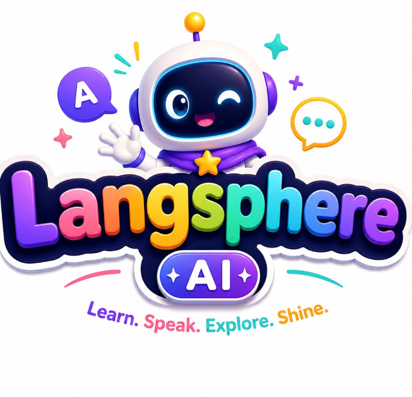

<div align="center">
  
  
  # Langsphere AI ✨
  **Learn. Speak. Explore. Shine.**

  <p>
    An intelligent, gamified language learning platform designed to help kids discover and master new languages with the power of Generative AI!
  </p>
</div>

---

## 🌟 Overview

**Langsphere AI** is an interactive, multi-tier educational application built with React Native and Expo. It seamlessly blends AI-generated content (powered by Google's Gemini), gamified progression, and immersive exercises to teach languages like Tamil, Hindi, Telugu, Malayalam, and Kannada. 

Instead of static textbooks, Langsphere AI adapts to the student's proficiency level in real-time, generating dynamic lessons tailored just for them!

## ✨ Key Features

- 🎯 **Dynamic Placement Test**: Automatically assesses a student's proficiency and places them into the correct tier (Beginner, Intermediate, Pro).
- ✍️ **AI Writing Canvas**: Practice writing alphabets and complex sentences by tracing directly on the screen, with content dynamically generated based on the user's level.
- 🔤 **Vocabulary Flashcards**: Gamified flashcard system with speech synthesis to practice listening and reading.
- 🗣️ **Conversational AI**: A friendly, interactive mascot that chats with students to improve their communication skills.
- 🎙️ **Pronunciation Engine**: Real-time voice recording and playback to perfect accents and fluency.
- 📖 **Reading Comprehension**: AI-generated short stories followed by interactive Q&A sessions.
- 👨‍👩‍👧 **Parent Portal**: A dedicated secure dashboard for parents to track their superstar's XP, day streaks, and module completions.

## 🛠️ Tech Stack

- **Frontend**: React Native, Expo, React Navigation (Expo Router)
- **Styling & Animations**: NativeWind (Tailwind CSS), React Native Reanimated
- **Backend & Auth**: Firebase (Authentication, Firestore Database)
- **Generative AI**: Google Gemini API (`@google/genai`)
- **Speech Services**: Expo Speech, Expo AV

## 🚀 Getting Started

### Prerequisites

- Node.js (v18 or higher)
- npm or yarn
- Expo CLI

### Installation

1. **Clone the repository:**
   ```bash
   git clone https://github.com/Funtime162005/pdd.git
   cd pdd
   ```

2. **Install dependencies:**
   ```bash
   npm install
   ```

3. **Set up Environment Variables:**
   Create a `.env` file in the root directory and add your keys:
   ```env
   EXPO_PUBLIC_FIREBASE_API_KEY=your_api_key
   EXPO_PUBLIC_FIREBASE_AUTH_DOMAIN=your_auth_domain
   EXPO_PUBLIC_FIREBASE_PROJECT_ID=your_project_id
   EXPO_PUBLIC_FIREBASE_APP_ID=your_app_id
   EXPO_PUBLIC_GEMINI_API_KEY=your_gemini_api_key
   ```

4. **Run the App:**
   ```bash
   # For Web
   npm run web

   # For iOS/Android (via Expo Go)
   npm start
   ```

## 📂 Project Structure

```
├── app/                  # Expo Router App Entry & Screens
│   ├── (auth)/           # Login, Register, Parent Login
│   ├── (parent)/         # Parent Dashboard Layout & Screens
│   ├── (tabs)/           # Main Gamified Student Dashboard
│   └── practice/         # Core Learning Modules (Writing, Reading, etc.)
├── assets/               # Images, Fonts, Avatars, and Logos
├── components/           # Reusable UI Components & Practice UIs
├── context/              # React Context (AuthContext)
├── utils/                # Helper functions (AI, Firebase, Speech)
└── server/               # (Optional) Node.js Backend Utilities
```

## 👨‍👩‍👧 Parent Portal Access

To access the Parent Portal, log out of the student view, return to the main Welcome Screen, and click **"Parent Portal"** at the bottom. Use the student's email and password to log in securely and view their progression analytics!

---

<div align="center">
  <i>Built with ❤️ for the future of language learning.</i>
</div>
